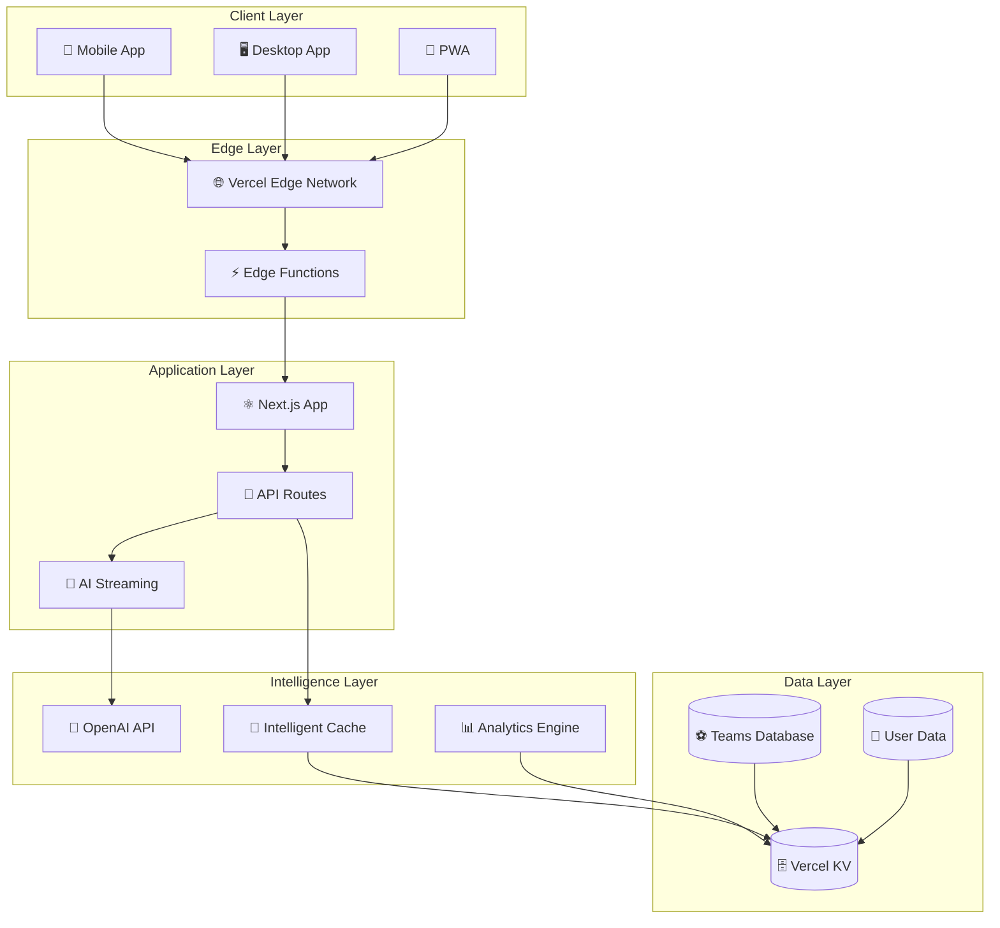
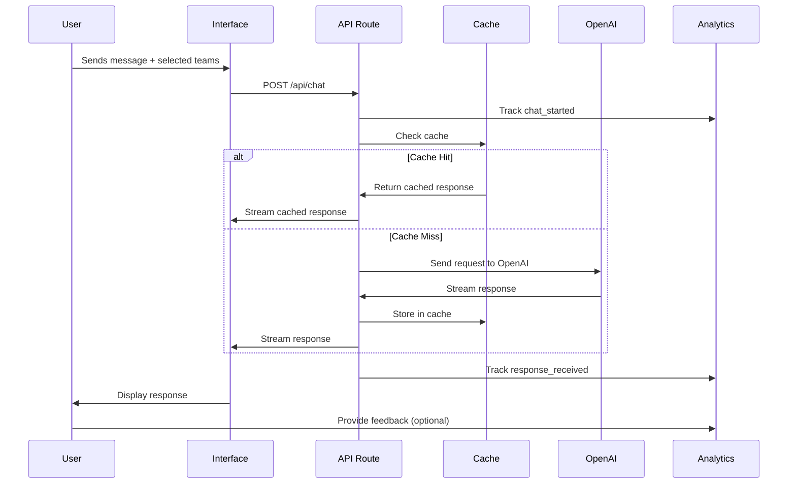
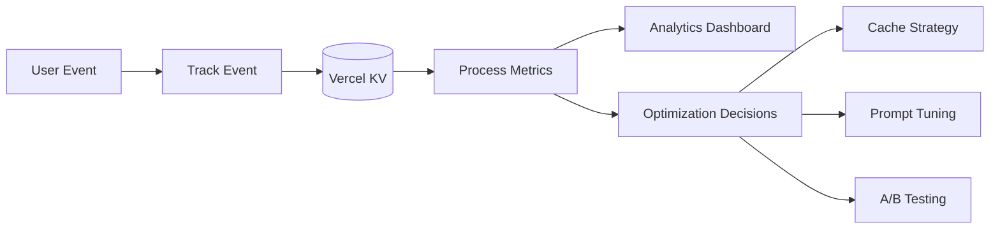

# 🏗️ Arquitetura do Sistema SportsGPT

## 📋 Visão Geral

O SportsGPT é construído como uma aplicação web moderna, usando uma arquitetura serverless com foco em performance, escalabilidade e experiência do usuário.

## 🎯 Princípios Arquiteturais

### **1. Mobile-First**
- Interface responsiva que funciona perfeitamente em todos os dispositivos
- Performance otimizada para conexões móveis
- Touch-friendly UI com gestos naturais

### **2. Serverless & Edge**
- API Routes do Next.js para backend
- Vercel Edge Functions para latência mínima
- Vercel KV para cache e sessões

### **3. Streaming & Real-time**
- Respostas em streaming da OpenAI
- Feedback visual em tempo real
- Cancelamento de requisições

### **4. Intelligent Caching**
- Cache baseado em contexto esportivo
- TTL dinâmico por tipo de pergunta
- Redução significativa de custos

## 🔧 Stack Tecnológica

### **Frontend**
```typescript
// Core
- Next.js 15 (App Router)
- TypeScript
- React 18

// Styling
- Tailwind CSS v4
- Shadcn UI
- Framer Motion

// State Management
- React hooks (useState, useEffect)
- Vercel AI SDK hooks
```

### **Backend**
```typescript
// API & Processing
- Next.js API Routes
- OpenAI API (GPT-3.5/4)
- Vercel AI SDK

// Storage & Cache
- Vercel KV (Redis)
- Edge-compatible storage

// Analytics
- Custom analytics system
- Real-time metrics
```

### **Infrastructure**
```yaml
# Hosting
- Vercel (hosting + functions)
- Edge Network global

# Databases
- Vercel KV (cache, sessions, analytics)
- Future: Supabase (user data, histórico)

# Monitoring
- Vercel Analytics
- Custom metrics dashboard
```

## 📊 Diagrama de Arquitetura



## 🔄 Fluxo de Dados

### **1. Requisição do Usuário**
```typescript
User Input → UI Component → API Route → Context Analysis
```

### **2. Processamento Inteligente**
```typescript
Context Analysis → {
  Cache Check → Cache Hit? → Return Cached Response
                ↓ Cache Miss
  Team Data Fetch → Prompt Building → OpenAI API
}
```

### **3. Resposta Streaming**
```typescript
OpenAI Response → Stream Processing → {
  Real-time UI Update
  Cache Storage
  Analytics Tracking
}
```

### **4. Analytics & Learning**
```typescript
User Interaction → Analytics Event → {
  Performance Metrics
  User Behavior
  Cost Optimization
  A/B Test Results
}
```

## 🏛️ Estrutura de Pastas

```
src/
├── app/                    # Next.js App Router
│   ├── api/               # API Routes
│   │   ├── chat/          # Chat endpoint
│   │   ├── analytics/     # Analytics API
│   │   └── teams/         # Teams data API
│   ├── globals.css        # Global styles
│   ├── layout.tsx         # Root layout
│   └── page.tsx           # Main page
│
├── components/            # React components
│   ├── ui/               # Base UI components
│   ├── chat-interface.tsx # Chat UI
│   ├── landing-page.tsx  # Landing page
│   └── team-logos.tsx    # Team components
│
├── lib/                  # Utilities & logic
│   ├── openai.ts         # OpenAI client
│   ├── prompts.ts        # Prompt engineering
│   ├── teams-data.ts     # Teams database
│   ├── cache-manager.ts  # Intelligent cache
│   ├── analytics.ts      # Analytics system
│   └── utils.ts          # Helper functions
│
└── docs/                 # Documentation
    ├── README.md
    ├── fase-1-*.md
    ├── fase-2-*.md
    ├── fase-3-*.md
    └── fase-4-*.md
```

## 🔒 Segurança

### **API Security**
- API keys nunca expostas no frontend
- Rate limiting por usuário/IP
- Validação de input rigorosa
- CORS configurado adequadamente

### **Data Privacy**
- Dados do usuário minimizados
- Cache com TTL apropriado
- Logs anonimizados
- GDPR compliant

### **Infrastructure Security**
- HTTPS everywhere
- Environment variables para secrets
- Vercel security best practices
- Regular security audits

## 📈 Escalabilidade

### **Horizontal Scaling**
```typescript
// Auto-scaling do Vercel
Requests → Edge Functions (auto-scale)
         → Serverless Functions (auto-scale)
         → KV Database (managed scaling)
```

### **Performance Optimization**
- Intelligent caching (30%+ hit rate)
- Edge computing (sub-100ms latency)
- Streaming responses (perceived performance)
- Optimized bundle size

### **Cost Management**
- Cache strategy reduz 40% dos custos
- Token usage otimizado
- Analytics para monitoring
- A/B testing para efficiency

## 🔄 Data Flow Detalhado

### **Chat Flow**


### **Analytics Flow**


## 🎯 Performance Targets

### **Response Times**
- Cache hit: < 200ms
- OpenAI response: < 3s
- First paint: < 1s
- Interactive: < 2s

### **Availability**
- Uptime: 99.9%
- Error rate: < 0.1%
- Cache hit rate: > 30%

### **User Experience**
- Mobile performance score: > 90
- Accessibility score: > 95
- SEO score: > 90

## 🔮 Futuras Expansões

### **Dados em Tempo Real**
- Integração com APIs de odds
- Dados de jogos ao vivo
- Notificações push

### **Machine Learning**
- Modelos próprios para previsões
- Personalização avançada
- Análise preditiva

### **Monetização**
- Planos premium
- API para terceiros
- Parcerias com casas de apostas

Esta arquitetura suporta todas as 4 fases de implementação e está preparada para escalar conforme o produto cresce! 🚀

